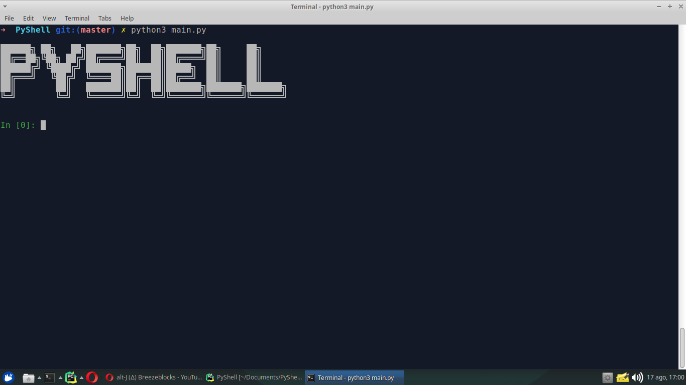

# URY


Interactive python shell

## Screenshot



## Setup
Install dependencies.
```bach
$ pip3 install dill
```

run
```bach
$ python3 main.py
```

## License
>You can check out the full license [here](https://github.com/oDallas/URY/blob/master/LICENSE)

This project is licensed under the terms of the **MIT** license.